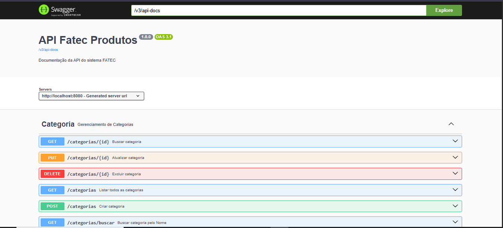
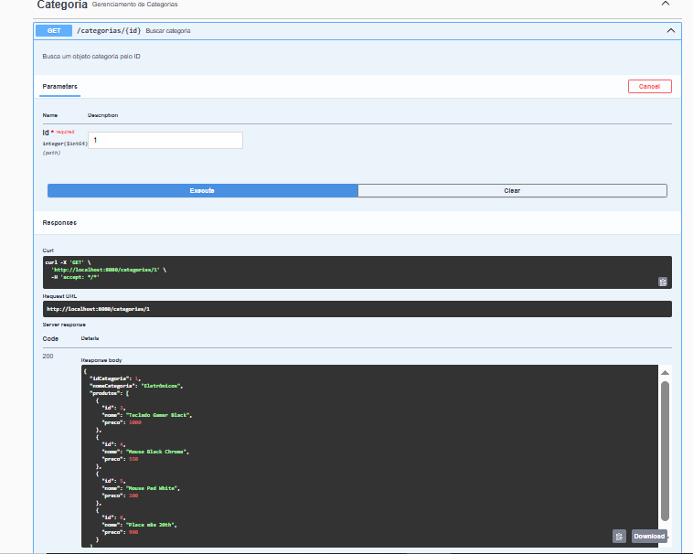
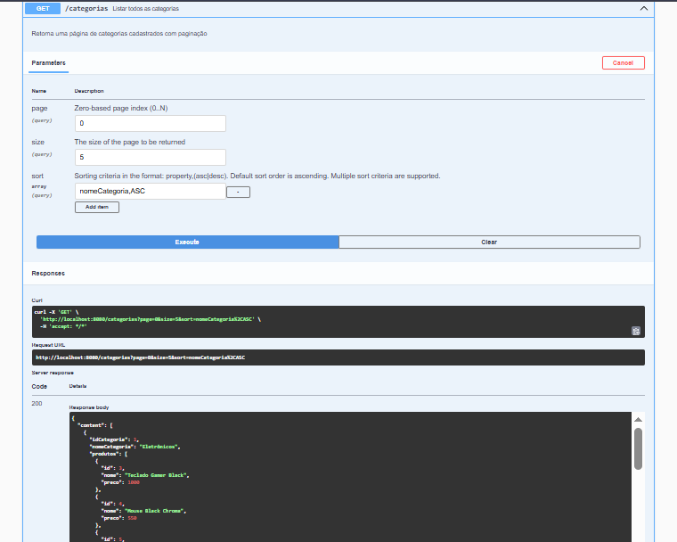

# 📦 API de Produtos e Categorias


API REST desenvolvida com **Spring Boot** para gerenciamento de produtos e categorias, com relacionamento **1:N**, paginação, ordenação dinâmica e documentação interativa com Swagger.

---

## 🚀 Tecnologias utilizadas

* Java 21
* Spring Boot 3
* Spring Data JPA
* PostgreSQL
* Hibernate
* Lombok
* Swagger (OpenAPI)
* Maven

---

## 📌 Funcionalidades

### 📁 Categorias

* Criar categoria
* Listar categorias (com paginação)
* Buscar categoria por ID
* Buscar categoria por nome (com filtro e paginação)
* Atualizar categoria
* Deletar categoria

### 📦 Produtos

* Criar produto com vínculo a categoria
* Listar produtos
* Buscar produto por ID
* Atualizar produto
* Deletar produto

---

## 🔗 Relacionamento

* Uma **Categoria** possui vários **Produtos** (1:N)
* Um **Produto** pertence a uma única **Categoria**

---

## ⚙️ Como executar o projeto

### 🔧 Pré-requisitos

* Java 21
* Maven
* PostgreSQL

---

### 1. Clonar repositório

```bash
git clone https://github.com/seu-usuario/seu-repo.git
cd seu-repo
```

---

### 2. Configurar banco de dados

```properties
spring.datasource.url=jdbc:postgresql://localhost:5432/seubanco
spring.datasource.username=seu_usuario
spring.datasource.password=sua_senha

spring.jpa.hibernate.ddl-auto=update
spring.jpa.show-sql=true
```

---

### 3. Executar aplicação

```bash
mvn spring-boot:run
```

---

## 📖 Documentação (Swagger)

Acesse:

```
http://localhost:8080/swagger-ui.html
```

---

## 🖼️ Demonstrações

### 🔹 Swagger da API



---

### 🔹 Buscar Categoria por ID



---

### 🔹 Listar Categorias (Paginação + Sort)



---

## 📌 Exemplos de uso

### 🔎 Buscar categoria por nome

```http
GET /categorias/buscar?nomeCategoria=Eletrônicos&page=0&size=5&sort=nomeCategoria,asc
```

---

### 📦 Criar produto com categoria

```json
{
  "nome": "Teclado Mecânico",
  "preco": 250.00,
  "idCategoria": 1
}
```

---

## 🧠 Arquitetura

* Controller → Entrada da API
* Service → Regras de negócio
* Repository → Acesso ao banco
* DTO → Padronização de request/response

---

## 🚀 Melhorias futuras

* Autenticação com JWT 🔐
* Filtros dinâmicos 🔎
* Padronização de response (PageDTO) 📊
* Testes automatizados 🧪
* Docker 🐳
* Deploy em nuvem ☁️

---

## 👨‍💻 Autor

**Yuri Ribeiro Abe**

---

## 📄 Licença

Projeto acadêmico para fins educacionais.
